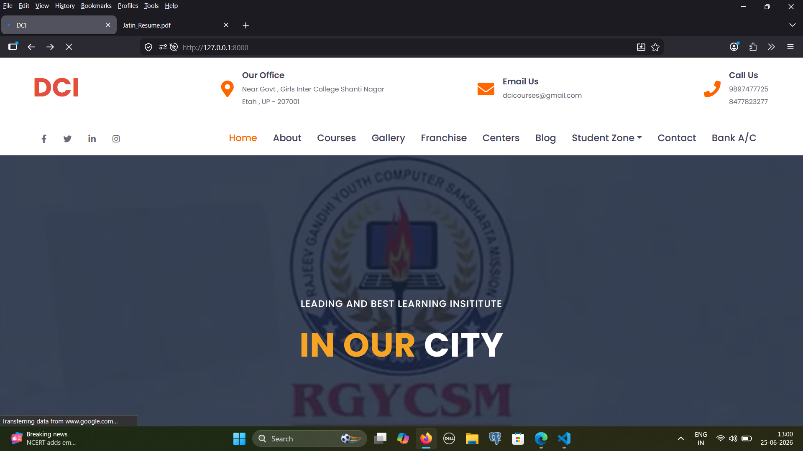
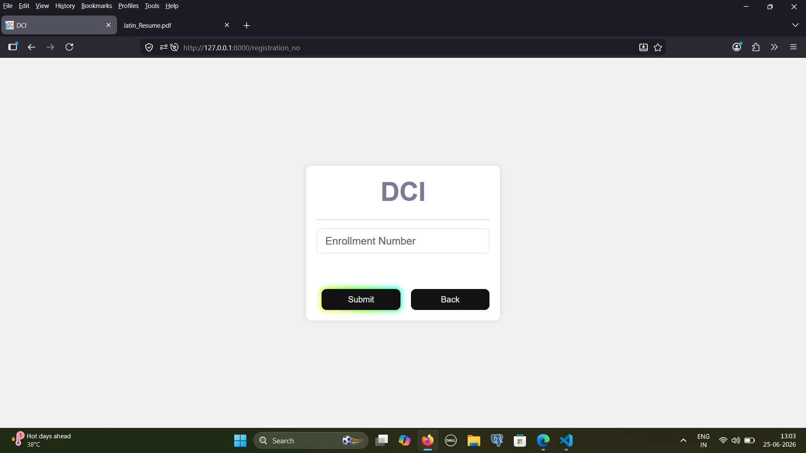
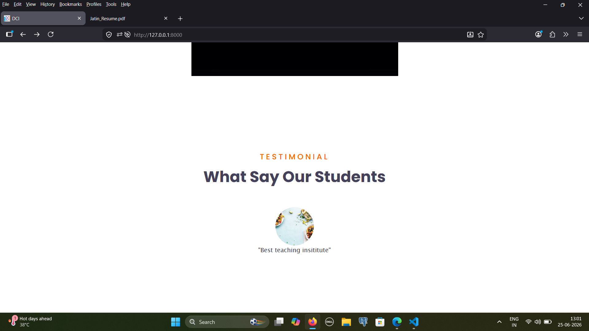

# 🎓 Digital Computer Institute Management System (DCI)

> A full-featured web-based student management platform built with Django — enabling course enrollment, automated enrollment number generation, PDF certificate downloads, and complete student record management.


---

## 📌 Overview

The **Digital Computer Institute Management System (DCI)** is a web application designed to digitize and automate the operations of a computer training institute. Students can self-register for courses, receive auto-generated enrollment numbers, and download their certificates — all without manual admin intervention.

This project solves a real-world problem faced by thousands of small-to-medium computer institutes across India that still rely on paper-based record keeping.

---

## 📸 Screenshots

**Home Page**



**Our Trending Courses**


**Enrollment Number Lookup**



**Contact Us**


**Student Testimonials**



---

## ✨ Features

| Feature | Description |
|--------|-------------|
| 🧑‍🎓 **Student Self-Registration** | Students can register themselves into any available computer course |
| 🔢 **Auto Enrollment Number** | Unique enrollment IDs are automatically generated on registration |
| 📄 **PDF Certificate Download** | Students can download their course enrollment/completion certificates as PDFs |
| 🗂️ **Course Management** | Admin can manage courses, batches, and student records |
| 📱 **Responsive UI** | Works seamlessly on desktop and mobile browsers |
| 🔒 **Secure Backend** | Django-powered backend with secure data handling |
| 📊 **Dynamic Data Processing** | Real-time record management and reporting |
| 📞 **Contact Form** | Students can reach the institute directly via the contact page |

---

## 🛠️ Tech Stack

### Backend
- **Python 3.10+** — Core language
- **Django 4.2.7** — Web framework (models, views, templates, ORM)
- **SQLite** — Development database

### PDF & Document Generation
- **ReportLab 4.0.7** — PDF generation engine
- **xhtml2pdf 0.2.13** — HTML to PDF conversion
- **pypdf 3.17.1** — PDF reading and manipulation
- **pyHanko 0.21.0** — PDF signing and digital certificates
- **qrcode 7.4.2** — QR code generation for certificates
- **Pillow 10.1.0** — Image processing

### Frontend
- **HTML5 / CSS3** — Responsive templates
- **Django Template Engine** — Dynamic UI rendering

### Utilities
- **arabic-reshaper + python-bidi** — RTL text support in PDFs
- **svglib / cssselect2** — SVG rendering in documents
- **cryptography / oscrypto** — Secure data handling

---

## 🚀 Getting Started

### Prerequisites
- Python 3.10+
- pip
- Git

### Installation

```bash
# 1. Clone the repository
git clone https://github.com/yourusername/digital-institute-management.git
cd digital-institute-management

# 2. Create and activate virtual environment
python -m venv venv

# Windows
venv\Scripts\activate

# Mac/Linux
source venv/bin/activate

# 3. Install all dependencies
pip install -r requirements.txt

# 4. Apply database migrations
python manage.py makemigrations
python manage.py migrate

# 5. Create admin superuser
python manage.py createsuperuser

# 6. Run the development server
python manage.py runserver
```

Then open your browser at **http://127.0.0.1:8000**

---

## 📦 Requirements

Full list of dependencies in `requirements.txt`. Key packages:

```
Django==4.2.7
reportlab==4.0.7
xhtml2pdf==0.2.13
Pillow==10.1.0
qrcode==7.4.2
pyHanko==0.21.0
pypdf==3.17.1
```

Install all with:
```bash
pip install -r requirements.txt
```

---

## 🎯 Use Case

This system is designed for **small computer training institutes** that:
- Manage 50–500+ students across multiple courses
- Need to issue certificates without manual effort
- Want to eliminate paper-based registration
- Offer multiple courses like ADCA, DOAP, DCA and more

---

## 🙋‍♂️ Author

**Jatin Panday**
- 📧 jatinpanday136@gmail.com
- 💼 [LinkedIn](https://www.linkedin.com/in/jatin-panday/)
- 🐙 [GitHub](https://github.com/JATIN-PANDAY)

---

## 📄 License

This project is licensed under the MIT License — see the (LICENSE) file for details.

---

> ⭐ If you found this project useful, please consider giving it a star on GitHub!
